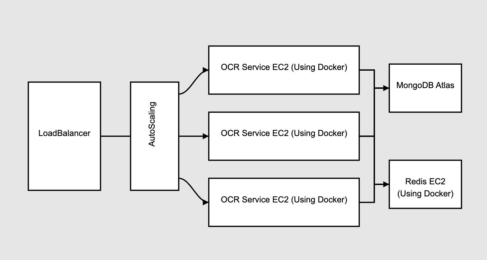

# PDF OCR Service

A scalable service for extracting text from PDF documents using OCR (Optical Character Recognition) and text extraction techniques.

## Architecture Overview

The service uses a load-balanced, auto-scaling architecture:



### Components:

1. **LoadBalancer**
   - Entry point for all requests
   - DNS: `dsllms-lb-2095661368.us-west-2.elb.amazonaws.com`

2. **AutoScaling Group**
   - Manages multiple OCR service instances
   - Scales up or down based on demand
   - Default: 3 EC2 instances

3. **OCR Service EC2 Instances**
   - Run using Docker containers: `alyssajin/ocr-service:latest`
   - Process PDF documents using OCR or text extraction
   - Connection to both MongoDB Atlas and Redis

4. **MongoDB Atlas**
   - Cloud-hosted database
   - Stores extracted text and document metadata

5. **Redis EC2 Instance**
   - Runs in a Docker container
   - Stores document processing status
   - Enables fast status checks

### Data Flow

1. Client sends request to the LoadBalancer
2. Request is routed to one of the OCR Service instances
3. OCR Service processes the PDF and stores status in Redis
4. Final extracted text is stored in MongoDB Atlas
5. Client can check processing status or retrieve results

## API Usage

Interact with the service using the following API endpoints:

### 1. Upload PDF for Processing

```
POST /extract
```

**Request:**
- Content-Type: multipart/form-data
- Parameters:
  - file: PDF file to process
  - document_id: Unique identifier for the document

**Response:**
```json
{
  "status": "ok"
}
```

### 2. Check Processing Status

```
GET /check-status/{document_id}
```

**Response:**
```json
{
  "status": "processing|completed|error"
}
```

### 3. Get Extracted Text

```
GET /result/{document_id}
```

**Response:**
```json
{
  "document_id": "your-document-id",
  "text": "Extracted text content from the PDF...",
  "status": "completed"
}
```

### 4. Service Health Check

```
GET /health
```

## Using the Service

To use this service, you only need to interact with the LoadBalancer DNS:
```
dsllms-lb-2095661368.us-west-2.elb.amazonaws.com
```

There's no need to set up or configure any infrastructure. Simply send requests to the appropriate endpoints.

### Typical Workflow:

1. Upload a PDF using the `/extract` endpoint with a unique document_id
2. Poll the `/check-status/{document_id}` endpoint until processing is complete
3. Once status is "completed", retrieve the text using the `/result/{document_id}` endpoint

## Detailed Documentation

For more detailed information:
- [API Documentation](API.md)
- Postman Collection

    https://.postman.co/workspace/My-Workspace~0900b330-0b33-4e69-8303-1d480323c938/folder/36481891-44098179-9469-47eb-a37d-6d1196512b6b?action=share&creator=36481891&ctx=documentation&active-environment=36481891-8c6e9129-bec0-49b6-b095-4fcb127e01d0
- [Deployment Guide](services/ocr_service_deploy/DEPLOYMENT.md)
